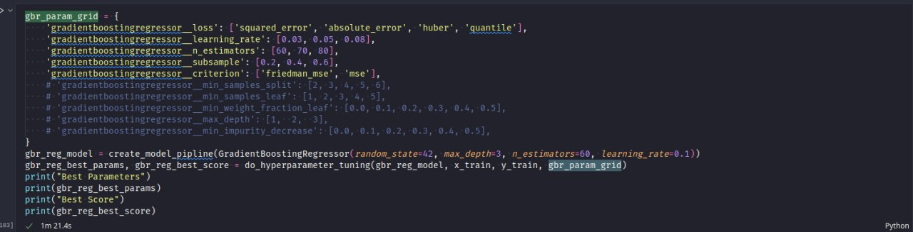
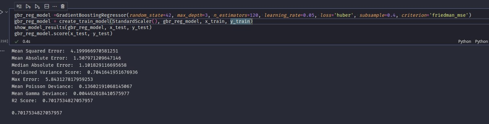

# Team-Earth
Olive (Ovulive) - A multi-functional platform focusing on a holistic approach towards female healthcare.

## Team Members

The project is being prepared under the supervision of Prof. Manoov R by the following team members:

Shruti Pandey (20BCE0665)\
Gopesh Kumar Pathak (20BCE2870)\
Nithin Bharath Kumar (20BCE0790)\
Adam Nellissery Jijo (20BCI0077)\
Angela Mathews (20BCI0140)

## School

School of Computer Science and Engineering, Vellore Institute of Technology, Vellore.

## Comparative Analysis
Irregular or unpredictable menstrual cycles can cause inconvenience and discomfort for many women. A period prediction algorithm can aid in managing menstrual health effectively by providing advance notice of upcoming periods. This can help women be better prepared with necessary supplies, manage symptoms such as pain or mood swings, and avoid unexpected disruptions in their daily routines. For women who are trying to conceive or avoid pregnancy, accurate prediction of menstrual cycles can be crucial. A period prediction algorithm can aid in fertility tracking and family planning by helping women identify their fertile window and plan intercourse or contraception accordingly. This can assist couples in achieving or avoiding pregnancy as per their preferences.

The unpredictability of menstrual cycles can impact women’s mental health, causing stress, anxiety, and mood swings. By providing accurate period predictions, a period prediction algorithm can help women better manage their emotional well-being by reducing uncertainty and promoting a sense of control over their menstrual cycles. 
A period prediction algorithm can be a valuable addition to the growing field of digital health, providing women with a convenient and accessible tool to track their menstrual cycles using smartphones or other devices. This can promote the adoption of digital health solutions and contribute to the advancement of women’s health care. Period prediction algorithms have the potential to be personalized to individual women’s health data, such as menstrual cycle length, flow, and symptoms.

## Dataset and Code for this analysis
- Dataset is present in the repository in the folder "dataset".
- Code for this analysis is also present in the repository named "workspace.ipynb".

## Methods used for this comparative analysis
- SGD Regressor: SGD (Stochastic Gradient Descent) Regressor is a type of linear regression algorithm that is particularly well-suited for large datasets or datasets with a high number of features. It updates the model parameters using a small subset of the data at a time, making it computationally efficient and scalable. SGD Regressor uses gradient descent optimization to minimize the error between the predicted and actual target values, allowing it to learn from the data and make predictions for menstrual cycle lengths or other relevant variables based on historical data.

- Random Forest Regressor: Random Forest Regressor is an ensemble learning method that combines multiple decision tree models to make predictions. It can be used for regression tasks in menstrual prediction algorithms to predict cycle length or other relevant variables based on historical data. Random Forest Regressor is capable of handling non-linear relationships in the data and can capture complex patterns and interactions among features. It is also robust to overfitting and can handle missing values in the data. Random Forest Regressor is a powerful method for menstrual prediction algorithms, particularly when there are multiple features and non-linear relationships in the data. 

- Gradient Boosting Regressor: Gradient Boosting Regressor is another ensemble learning method that combines multiple weak learners, such as decision trees, to make predictions. It can be used for regression tasks in menstrual prediction algorithms to predict cycle length or other relevant variables based on historical data. Gradient Boosting Regressor iteratively builds a model by minimizing the residual errors from the previous iteration, which allows for the creation of a strong predictive model. It is particularly effective in capturing complex patterns in the data and can handle large datasets. Gradient Boosting Regressor is a powerful method for improving the accuracy and predictive power of menstrual prediction algorithms.

- Decision Tree Regressor: Decision Tree Regressor is a nonlinear regression algorithm that models decisions or decisions based on the values of input features. It can be used for predicting menstrual cycle lengths or other relevant variables based on historical data. Decision Tree Regressor works by recursively splitting the data based on feature values to create a tree-like structure that predicts the target variable. It is capable of capturing non-linear relationships in the data and can handle both numerical and categorical features. Decision Tree Regressor is relatively simple to implement and interpret, making it a useful method for menstrual prediction algorithms.

- Support Vector Regression (SVR): Support Vector Regression is a powerful algorithm for menstrual prediction models that can accurately predict the length of menstrual cycles based on historical data. SVR requires data preparation, feature engineering, model training, model evaluation, hyperparameter tuning, and model deployment. SVR models can be created using machine learning libraries such as scikit-learn in Python, and hyperparameters such as the kernel type, regularization parameter, and epsilon need to be tuned to optimize the model’s performance.

## Tools used
- Pandas is a popular data manipulation library in Python that provides data structures such as DataFrame and Series, which are useful for handling and processing large datasets.

- Scikit-learn is a popular machine learning library in Python that provides a wide range of algorithms for classification, regression, clustering, and other machine learning tasks.

- Jupyter Notebook is an open-source web-based environment that allows for the creation and sharing of live code, equations, visualizations, and narratives in a single document.

- Jupyter Notebook allows for easy collaboration and sharing of code and results, making it a useful tool for interdisciplinary teams working on menstrual prediction projects.

## Analysis
We used the Menstrual Cycle Data (Fehring, Richard 2012) for our analysis. While there was less data than we would have liked to have, it was the best option we found due to the severe lack of publicly available datasets pertaining to menstrual cycles. We had to preprocess the data since it was organized in such a way that only the first row for each client would contain data that would remain the same for the client (eg. age, height, etc). After this was taken care of we conducted an analysis of the dataset with:
- SGD Regressor (R2 Score = 0.637)
- Random Forest Regressor (R2 Score = 0.659)
- Support Vector Regressor (R2 Score = 0.602)
- Gradient Boosting Regressor (R2 Score = 0.659)

## Metrics Used
- Mean Squared Error (MSE): MSE measures the average squared difference between the predicted and actual values of the target variable. It would quantify how well the app’s predictions match the actual timing of menstrual periods. A lower MSE value indicates more accurate predictions, with smaller errors between predicted and actual values.
- Mean Absolute Error (MAE): MAE measures the average absolute difference between the predicted and actual values of the target variable. A lower MAE value would indicate smaller average errors in predicting the timing of menstrual periods, which could be beneficial for improving the app’s performance.
- Median Absolute Error (MedAE): MedAE measures the median of the absolute differences between the predicted and actual values of the target variable. MedAE could provide a robust measure of prediction accuracy, especially when dealing with potential outliers in menstrual data.
- Explained Variance Score: Explained Variance Score measures the proportion of the variance in the target variable that is explained by the model’s predictions. a higher explained variance score would indicate that the app’s predictions are able to explain a larger proportion of the variability in menstrual period timing, suggesting better accuracy.
- Max Error: Max Error measures the maximum absolute difference between the predicted and actual values of the target variable. a smaller Max Error value would indicate lower maximum prediction errors, suggesting more accurate predictions and better performance of the app.
- Mean Poisson Deviance and Mean Gamma Deviance: Mean Poisson Deviance and Mean Gamma Deviance are evaluation metrics commonly used for count data and gamma distributed data, respectively.
- R2 Score: R2 Score, or the coefficient of determination, measures the proportion of the variance in the target variable that is explained by the model. It is a widely used metric for regression problems, including period prediction apps.

## Results
On comparison of different algorithms, we have found that the Gradient Boosting Regressor is the most suitable algorithm for period analysis according to the metrics like mean squared error, R2 score and Mean Poisson Deviance. The following result has been obtained:
- Mean Squared Error: 4.199966970581251
- Mean Absolute Error: 1.507971209647146
- Median Absolute Error: 1.101829116695658
- Explained Variance Score: 0.7041641951676936
- Max Error: 5.843127817959253
- Mean Poisson Deviance: 0.13602191068145067
- Mean Gamma Deviance: 0.004462618410575977
- R2 Score: 0.7017534827057957

## Website Documentation from here on
## Project Workflow

**Tools Used**
- GitHub
- GitHub Desktop / GitHub CLI
- Zotero
- Obsidian
- VSCode
- Moodle
- WhatsApp
- Jira

**Workflow**
  - We plan on collaborating on code and documentation over GitHub using either GitHub CLI/GitHub Desktop locally. Zotero will be used for keeping track of references, Obsidian for editing Markdown files and maintaining personal knowledge bases and VSCode for writing code.
Moodle will be used for submissions and communication with the professor, while WhatsApp will be used as the primary means of communication between our group members. Meanwhile Jira will be used to keep track of deadlines and project management.
The Jira board has also been created to keep track of issues that need to be worked on and assigning contributions. It is also synced with GitHub so that issues can be resolved automatically when a relevant commit is made.

## Progress Overview

**Project** | **Status** | **Notes**
--- | --- | ---
Project Title and Purpose | `Completed` | The idea suggested by Gopesh and after consideration along with a discussion on the topic and also comparing the 2 ideas that were presented, we moved on with this one and concluded to move ahead with the next part of the process.
Research | `Launched` | All members will be researching various already deployed applications which would help in building the general concept and functionalities the app would need. Also, what features users will be expecting from Ovulive. Not only this but the drawbacks which other apps already have will be discussed and tried to resolve.
Features/Functionalities | `Launched` | All the features we require in the app, are put forward by all the members of the group, and implementation of the same is discussed. This is a research-oriented process and would be completed as the project moves ahead.
Design and Layout | `Launched` | The General UI/UX layout will be created once the functionalities are finalized, Angela along with Shruti will work on a suitable UI design for a cross-platform application (Android & IOS).
Website | `Started on with` | Nithin would be focusing on the initial website which would display the idea and concept of the application and then the deployment would be aided by Gopesh and Adam.
Front-End Development | `Started with the design` | Once all the features/functionalities and requirements are discussed and finalized, Angela, Adam, Gopesh, Nithin, Shruti will be working on the front end (Client-side) of the application to complete each page of the application. This part of the project should take around 25 days – 1.5 months (depending on the functionalities).
Back-End Development | `Started` | Gopesh and Adam will work on the back-end (server-side) part of the project which will span over a month and a half. Apart from this, setting up the database would be Nithin, Gopesh, and Adam’s part.
Testing | `Not Started` | To be started once the application is deployed.

## Project Overview

Olive (Ovulive) is a multi-functional platform focusing on a holistic approach in female healthcare. It is estimated that females make up about 49.58% of the world population, and it is crucial to take precautions to shield the reproductive health against infections, damage, and issues, including specific long-term health issues. The aim of Olive is to provide a solution in the form of an app, by creating a platform that will provide the following:

- Period Tracking
- Intake of pills, contraceptives
- Note-taking
- Forums for chatting
- Blogs
- Health monitoring and vitals monitoring for all
- Other Menstrual needs
- Negative side effects monitoring, and support
- Live doctor/psychologist recommendations
- Real-time data visuals

## Problem Statement

Menstrual tracking is an important aspect of women's health, but many women do not have access to a reliable and user-friendly tracking solution. Olive aims to develop a mobile application that provides not only menstrual tracking, but also other features to support women's health, such as blogs, analytics, and a pill reminder.

## Scope of the Project

Addresses a real need: Menstrual health is an important aspect of women's health, and many women experience difficulties managing their menstrual cycle and related health issues. This project provides a solution to this problem by providing an application that helps women track their menstrual cycle and provides access to educational resources and support to help manage related health issues.

Utilizes technology to solve a problem: Technology can be used to improve people's lives in many ways, and this project is a prime example of that. The application provides a convenient and accessible way for women to track and manage their menstrual health, and the blogs and forums provide a platform for women to connect with others and access helpful information and support.

Combines multiple functions: The multifunctional nature of Olive allows women to track their menstrual cycle and manage their health, as well as connect with others and access helpful resources, all in one place.

## Tools/Software

- React Native: An open-source framework for building native mobile apps using JavaScript and React.
- Node.js and npm: JavaScript runtime environment and a package manager for Node.js.
- React Native CLI: Command-line interface for React Native development.
- Code Editor: For writing and editing the source code of your React Native app. Examples: Visual Studio Code, Atom, Sublime Text.
- Android Studio or Xcode: IDEs for developing and testing Android and iOS apps.
- Firebase or another backend service: For storing and retrieving data.
- Charting libraries: To display menstrual cycle data. Examples: react-native-chart-kit, react-native-charts-wrapper, react-native-highcharts.
- Device sensors and APIs: For tracking menstrual health data.
- Test devices: Smartphones or tablets running Android or iOS

## Technical Details

The app will be based primarily on Android given that iOS already has its own health app which has multiple features within itself, but the overall idea will be based on improving those features and bringing in better novelties into the product, and then creating an iOS alternative for the same. For the tech stack, the team will be trying to create a cross-platform app through React Native or Xamarin, or Flutter, depending on the complexities of the functionalities of the application. Figma and Adobe XD will be used for prototyping and initial display. The expected completion time for the project is 3.5-4.5 months with most of the functionalities expected to be fulfilled.

## Research Material (Updated whenever new content is found)

**Journal articles:**
- "Smartphone apps for menstrual pain and symptom management: A scoping review" by L. Trepanier,  ́E. Lamoureux, and S. Bjornson contains an extensive survey of 119 iOS menstrual applications. Through this survey it was made clear that very few apps have freely available intervention content and even the available content was of fairly low quality. There was also a general trend in the apps being unscientific, for example using pain assessment measures that haven't been validated (pictoral rating scale, checkmarks, etc), and even when they offered evidence based approaches like yoga or exercise, there was still no evidence that the content itself aligned with modern research or was reviewed by a professional. Lack of inclusivity was also observed since more than half the apps used feminine design aesthetics, which are found to be distressing to people who menstruate and do not identify as women, and even people who identify as women have been found to find these designs condescending and undesirable.
  - Link: https://www.sciencedirect.com/science/article/pii/S2214782923000052

- ""A good little tool to get to know yourself a bit better": a qualitative study on users' experiences of app-supported menstrual tracking in Europe" by J. Levy, and N Romo-Avilés, provides results of 26 qualitative interviews on users' experiences with menstrual apps. While some users stopped using the app since it took up too much time from their day or due to privacy concerns, other users found it to be a great tool to learn more about themselves. Users also reported that they tracked fewer features over time, as they gained knowledge. For instance, if they tracked their mood, they might realize that they had good moods while ovulating and bad moods on their period. After this realization, they felt no need to keep tracking their mood. The app also helped these users validate whether certain moods or emotions they were feeling were related to their cycle or not.
  - Link: https://link.springer.com/article/10.1186/s12889-019-7549-8

  
**Conference papers:**
- "Interaction Design of Fertility Tracking Application Using User-Centered Design" by M. Faizatti and F. Arifiansyah, specifies that the purpose of this study is to develop an interaction design that can serve both typical and unusual FTA users. User input in the form of feedback forms drives iterations of the design process because the design methodology is user-centered design. 
  - Link: https://ieeexplore.ieee.org/abstract/document/9971817/
  
- "A Critical Appraisal of Fertility and Menstrual Tracking Apps for the iPhone" by R. Zwingerman, M. Chaikof, and C. Jones, systematically assess and critically evaluate iPhone applications for tracking menstrual cycles, predicting ovulation, and other subjects pertaining to fertility and/or the treatment of infertility.
  - Link: https://www.sciencedirect.com/science/article/abs/pii/S1701216319308825
  
**Technical reports:**
- "Menstrual Hygiene ManagementProgramming in Maharashtra: The journey of a decade" by UNICEF, provides an overview of the current state of knowledge on menstrual health and can help you understand the key issues and challenges in this area. 
  - (Link: https://www.unicef.org/rosa/media/11831/file)

**Online resources:**
- The Women's Health Research Institute at Northwestern University provides information on menstrual health and technology, including studies and reports on the use of technology for menstrual health monitoring. 
  - Link: https://academic.oup.com/jamia/article/29/2/385/6382239
  
- The World Health Organization provides information on menstrual health and hygiene, including guidelines for menstrual health management in schools and communities.
  - Link: https://www.unicef.org/media/91341/file/UNICEF-Guidance-menstrual-health-hygiene-2019.pdf

**Expert opinions:**
- "International Clinical Practice Guidelines for the Management of Heavy Menstrual Bleeding" by the International Federation of Gynecology and Obstetrics provides recommendations for the management of heavy menstrual bleeding and can help you understand the clinical aspects of menstrual health. 
  - Link: https://www.nature.com/articles/s41746-019-0139-4
  
- The American College of Obstetricians and Gynecologists (ACOG) provides information on women's health issues, including menstrual health, and can offer insights into the latest research and best practices in this area. 
  - Link: https://www.acog.org/Clinical-Guidance-and-Publications/Committee-Opinions/Committee-on-Health-Care-for-Underserved-Women/Mobile-Health-Technology-in-Obstetrics-and-Gynecology
  
**Industry reports:**
- Reports from market research firms (e.g., Frost & Sullivan, TechSci Research) can provide insights into the trends and opportunities in the mobile health and menstrual health monitoring market, including the adoption and usage patterns of these applications.
  - Link: https://www.mordorintelligence.com/industry-reports/menstrual-health-apps-market

**Government and nonprofit organizations:**
- The U.S. Food and Drug Administration (FDA) provides information on the regulation of mobile medical applications, including menstrual health monitoring apps, and can help you understand the legal and regulatory requirements for these applications. 
  - Link: https://www.unicef.org/documents/guidance-monitoring-menstrual-health-and-hygiene
  
- Nonprofit organizations that focus on women's health, such as the National Women's Health Resource Center and the Women's Health Foundation, can provide information on the latest research and developments in menstrual health and can offer insights into the needs and priorities of women in this area.
  - Link: https://www.ncbi.nlm.nih.gov/pmc/articles/PMC7013590/

## Functionalities (Discussed upon)

- Mood Tracker:
  - Users can track their moods and emotions along with their menstrual cycle data to better understand the relationship between them.
- Symptom Tracker:
  - Users can track physical symptoms such as cramps, headaches, bloating, etc. along with their menstrual cycle data.
  - validated pain assessment measure (10 point rating scale/verbal rating scale)
- Cycle Comparison:
  - Users can compare their current cycle data with previous cycles to track changes and trends over time.
- Fertility Tracker:
  - Users can track their fertile days and ovulation to plan or prevent pregnancy.
- Community:
  - Users can connect with other women who use the application to share experiences and support each other.
- Health and Wellness Integrations:
  - The application can integrate with other health and wellness apps to provide a more comprehensive view of the user's overall health.
- Language Support:
  - The application can support multiple languages to reach a wider audience and make it accessible to users with different language preferences.
- Medication Reminder:
  - Users can set reminders for taking medication or other treatments related to their menstrual cycle.
- Period Predictor:
  - The application can predict the start and end date of the user's next period based on the data entered for previous cycles.
- Cycle History:
  - Users can view a detailed history of their menstrual cycles, including dates, symptoms, moods, etc.
- Health Reports:
  - The application can generate personalized health reports based on the user's menstrual data and other health information.
- Integration with Health Providers:
  - The application can integrate with healthcare providers, clinics, or hospitals to allow users to share their menstrual cycle data with their doctors.
- Menstrual Cycle Log:
  - Users can log specific details about their menstrual cycle, including flow intensity, pain levels, and more.
- Personalized Insights:
  - The application can provide personalized insights and recommendations based on the user's menstrual cycle data, lifestyle factors, and more.
- Educational Content:
  - The application can provide educational content on menstrual health, fertility, and other related topics.
  - This can include articles, videos, infographics, and more to help users learn more about their bodies and menstrual health.
- Pregnancy Tracker:
  - Users can track their pregnancy journey and monitor symptoms and changes related to their pregnancy.
- Menstrual Cup Management:
  - Users can track the usage of menstrual cups and receive reminders for cleaning and replacement.
- User Groups:
  - Users can join or create groups with others who have similar menstrual cycle experiences or interests.
  - This can provide a supportive community for users and allow them to connect with others for support and advice.
- Pain Management Intervention Content
  - free, high-quality intervention content
  - evidence based approaches (yoga, exercise, nutrition) for pain management
  - meditation and mindfulness content
- User Profile
  - trying to get pregnant (conservative estimates for fertile window) or using app as contraceptive method (overestimates for fertile window)
  - stage in life (post-natal, peri-menopause, newly menstruating)
- Offline-only Mode
  - store as much data offline and ensure app can function offline
  - opt-in telemetry
- User Centric Design
  - user centric, gender neutral design
  - process to collect user feedback
  - allow user to select features they want to track
- Aid with user anxiety
  - when irregular periods, reassure users that irregular periods are common and not necessarily indicator of bad health
  - show common symptoms associated with current cycle
