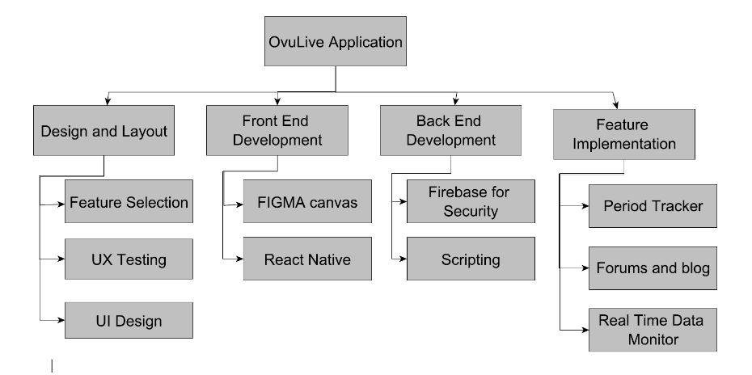

# Team-Earth
Olive (Ovulive) - A multi-functional platform focusing on a holistic approach towards female healthcare.

## Team Members

The project is being prepared under the supervision of Prof. Manoov R by the following team members:

Shruti Pandey (20BCE0665)\
Gopesh Kumar Pathak (20BCE2870)\
Nithin Bharath Kumar (20BCE0790)\
Adam Nellissery Jijo (20BCI0077)\
Angela Mathews (20BCI0140)

## School

School of Computer Science and Engineering, Vellore Institute of Technology, Vellore.

## Project Workflow

**Tools Used**
- GitHub
- GitHub Desktop / GitHub CLI
- Zotero
- Obsidian
- VSCode
- Moodle
- WhatsApp
- Jira

**Workflow**
  - We plan on collaborating on code and documentation over GitHub using either GitHub CLI/GitHub Desktop locally. Zotero will be used for keeping track of references, Obsidian for editing Markdown files and maintaining personal knowledge bases and VSCode for writing code.
Moodle will be used for submissions and communication with the professor, while WhatsApp will be used as the primary means of communication between our group members. Meanwhile Jira will be used to keep track of deadlines and project management.
The Jira board has also been created to keep track of issues that need to be worked on and assigning contributions. It is also synced with GitHub so that issues can be resolved automatically when a relevant commit is made.

## Progress Overview

**Project** | **Status** | **Notes**
--- | --- | ---
Project Title and Purpose | `Completed` | The idea suggested by Gopesh and after consideration along with a discussion on the topic and also comparing the 2 ideas that were presented, we moved on with this one and concluded to move ahead with the next part of the process.
Research | `Launched` | All members will be researching various already deployed applications which would help in building the general concept and functionalities the app would need. Also, what features users will be expecting from Ovulive. Not only this but the drawbacks which other apps already have will be discussed and tried to resolve.
Features/Functionalities | `Launched` | All the features we require in the app, are put forward by all the members of the group, and implementation of the same is discussed. This is a research-oriented process and would be completed as the project moves ahead.
Design and Layout | `Launched` | The General UI/UX layout will be created once the functionalities are finalized, Angela along with Shruti will work on a suitable UI design for a cross-platform application (Android & IOS).
Website | `Started on with` | Nithin would be focusing on the initial website which would display the idea and concept of the application and then the deployment would be aided by Gopesh and Adam.
Front-End Development | `Started with the design` | Once all the features/functionalities and requirements are discussed and finalized, Angela, Adam, Gopesh, Nithin, Shruti will be working on the front end (Client-side) of the application to complete each page of the application. This part of the project should take around 25 days – 1.5 months (depending on the functionalities).
Back-End Development | `Not Started` | Gopesh and Adam will work on the back-end (server-side) part of the project which will span over a month and a half. Apart from this, setting up the database would be Nithin, Gopesh, and Adam’s part.
Testing | `Not Started` | To be started once the application is deployed.

## Project Overview

Olive (Ovulive) is a multi-functional platform focusing on a holistic approach in female healthcare. It is estimated that females make up about 49.58% of the world population, and it is crucial to take precautions to shield the reproductive health against infections, damage, and issues, including specific long-term health issues. The aim of Olive is to provide a solution in the form of an app, by creating a platform that will provide the following:

- Period Tracking
- Intake of pills, contraceptives
- Note-taking
- Forums for chatting
- Blogs
- Health monitoring and vitals monitoring for all
- Other Menstrual needs
- Negative side effects monitoring, and support
- Live doctor/psychologist recommendations
- Real-time data visuals

## Problem Statement

Menstrual tracking is an important aspect of women's health, but many women do not have access to a reliable and user-friendly tracking solution. Olive aims to develop a mobile application that provides not only menstrual tracking, but also other features to support women's health, such as blogs, analytics, and a pill reminder.

## Scope of the Project

Addresses a real need: Menstrual health is an important aspect of women's health, and many women experience difficulties managing their menstrual cycle and related health issues. This project provides a solution to this problem by providing an application that helps women track their menstrual cycle and provides access to educational resources and support to help manage related health issues.

Utilizes technology to solve a problem: Technology can be used to improve people's lives in many ways, and this project is a prime example of that. The application provides a convenient and accessible way for women to track and manage their menstrual health, and the blogs and forums provide a platform for women to connect with others and access helpful information and support.

Combines multiple functions: The multifunctional nature of Olive allows women to track their menstrual cycle and manage their health, as well as connect with others and access helpful resources, all in one place.

## Tools/Software

- React Native: An open-source framework for building native mobile apps using JavaScript and React.
- Node.js and npm: JavaScript runtime environment and a package manager for Node.js.
- React Native CLI: Command-line interface for React Native development.
- Code Editor: For writing and editing the source code of your React Native app. Examples: Visual Studio Code, Atom, Sublime Text.
- Android Studio or Xcode: IDEs for developing and testing Android and iOS apps.
- Firebase or another backend service: For storing and retrieving data.
- Charting libraries: To display menstrual cycle data. Examples: react-native-chart-kit, react-native-charts-wrapper, react-native-highcharts.
- Device sensors and APIs: For tracking menstrual health data.
- Test devices: Smartphones or tablets running Android or iOS

## Technical Details

The app will be based primarily on Android given that iOS already has its own health app which has multiple features within itself, but the overall idea will be based on improving those features and bringing in better novelties into the product, and then creating an iOS alternative for the same. For the tech stack, the team will be trying to create a cross-platform app through React Native or Xamarin, or Flutter, depending on the complexities of the functionalities of the application. Figma and Adobe XD will be used for prototyping and initial display. The expected completion time for the project is 3.5-4.5 months with most of the functionalities expected to be fulfilled.

## Research Material (Updated whenever new content is found)

**Journal articles:**
- "Smartphone apps for menstrual pain and symptom management: A scoping review" by Lindsey C.M. Tr ́epanier a,  ́Elisabeth Lamoureux b, Sarah E. Bjornson a, Cayley Mackie a
  - Link: https://www.sciencedirect.com/science/article/pii/S2214782923000052
- "A Review of Mobile Health Applications for Women's Reproductive Health" by J. Zhang, X. Du, and X. Wang, provides a comprehensive overview of existing mobile health applications for women's reproductive health and can help you understand the current state of the field.
  - Link: https://dl.acm.org/doi/abs/10.1145/3491102.3517662
  
- "Using Smartphone Technology to Monitor Menstrual Cycle: A Systematic Review" by A. Jain, K. Venkatesh, and S. R. Jain, provides an overview of existing smartphone-based menstrual cycle monitoring applications and can help you understand the user requirements and the features that have been developed so far. 
  - Link: https://www.sciencedirect.com/science/article/pii/S2214782923000052
  
**Conference papers:**
- "Interaction Design of Fertility Tracking Application Using User-Centered Design" by M. Faizatti and F. Arifiansyah, specifies that the purpose of this study is to develop an interaction design that can serve both typical and unusual FTA users. User input in the form of feedback forms drives iterations of the design process because the design methodology is user-centered design. 
  - Link: https://ieeexplore.ieee.org/abstract/document/9971817/
  
- "Towards a Personalized Menstrual Health Monitoring System: A User-Centered Design Approach" by L. Chen, Y. Guo, and Y. Liu, presents a user-centered design approach to menstrual health monitoring and can provide ideas for developing personalized menstrual health monitoring applications. 
  - Link: https://dl.acm.org/doi/abs/10.1145/3025453.3025635
  
**Technical reports:**
- "Menstrual Health Monitoring: A Review of the Literature" by UNICEF, provides an overview of the current state of knowledge on menstrual health and can help you understand the key issues and challenges in this area. 
  - (Link: https://www.unicef.org/publications/files/Menstrual_Health_Monitoring_A_review_of_the_literature_June_2017.pdf)

**Online resources:**
- The Women's Health Research Institute at Northwestern University provides information on menstrual health and technology, including studies and reports on the use of technology for menstrual health monitoring. 
  - Link: https://academic.oup.com/jamia/article/29/2/385/6382239
  
- The World Health Organization provides information on menstrual health and hygiene, including guidelines for menstrual health management in schools and communities.
  - Link: https://repository.unar.ac.id/jspui/handle/123456789/2167

**Expert opinions:**
- "International Clinical Practice Guidelines for the Management of Heavy Menstrual Bleeding" by the International Federation of Gynecology and Obstetrics provides recommendations for the management of heavy menstrual bleeding and can help you understand the clinical aspects of menstrual health. 
  - Link: https://www.nature.com/articles/s41746-019-0139-4
  
- The American College of Obstetricians and Gynecologists (ACOG) provides information on women's health issues, including menstrual health, and can offer insights into the latest research and best practices in this area. 
  - Link: https://www.acog.org/Clinical-Guidance-and-Publications/Committee-Opinions/Committee-on-Health-Care-for-Underserved-Women/Mobile-Health-Technology-in-Obstetrics-and-Gynecology
  
**Industry reports:**
- Reports from market research firms (e.g., Frost & Sullivan, TechSci Research) can provide insights into the trends and opportunities in the mobile health and menstrual health monitoring market, including the adoption and usage patterns of these applications.
  - Link: https://www.mordorintelligence.com/industry-reports/menstrual-health-apps-market

**Government and nonprofit organizations:**
- The U.S. Food and Drug Administration (FDA) provides information on the regulation of mobile medical applications, including menstrual health monitoring apps, and can help you understand the legal and regulatory requirements for these applications. 
  - Link: https://www.unicef.org/documents/guidance-monitoring-menstrual-health-and-hygiene
  
- Nonprofit organizations that focus on women's health, such as the National Women's Health Resource Center and the Women's Health Foundation, can provide information on the latest research and developments in menstrual health and can offer insights into the needs and priorities of women in this area.

## Functionalities (Discussed upon)

- Mood Tracker:
  - Users can track their moods and emotions along with their menstrual cycle data to better understand the relationship between them.
- Symptom Tracker:
  - Users can track physical symptoms such as cramps, headaches, bloating, etc. along with their menstrual cycle data.
- Cycle Comparison:
  - Users can compare their current cycle data with previous cycles to track changes and trends over time.
- Fertility Tracker:
  - Users can track their fertile days and ovulation to plan or prevent pregnancy.
- Community:
  - Users can connect with other women who use the application to share experiences and support each other.
- Health and Wellness Integrations:
  - The application can integrate with other health and wellness apps to provide a more comprehensive view of the user's overall health.
- Language Support:
  - The application can support multiple languages to reach a wider audience and make it accessible to users with different language preferences.
- Medication Reminder:
  - Users can set reminders for taking medication or other treatments related to their menstrual cycle.
- Period Predictor:
  - The application can predict the start and end date of the user's next period based on the data entered for previous cycles.
- Cycle History:
  - Users can view a detailed history of their menstrual cycles, including dates, symptoms, moods, etc.
- Health Reports:
  - The application can generate personalized health reports based on the user's menstrual data and other health information.
- Integration with Health Providers:
  - The application can integrate with healthcare providers, clinics, or hospitals to allow users to share their menstrual cycle data with their doctors.
- Menstrual Cycle Log:
  - Users can log specific details about their menstrual cycle, including flow intensity, pain levels, and more.
- Personalized Insights:
  - The application can provide personalized insights and recommendations based on the user's menstrual cycle data, lifestyle factors, and more.
- Educational Content:
  - The application can provide educational content on menstrual health, fertility, and other related topics.
  - This can include articles, videos, infographics, and more to help users learn more about their bodies and menstrual health.
- Pregnancy Tracker:
  - Users can track their pregnancy journey and monitor symptoms and changes related to their pregnancy.
- Menstrual Cup Management:
  - Users can track the usage of menstrual cups and receive reminders for cleaning and replacement.
- User Groups:
  - Users can join or create groups with others who have similar menstrual cycle experiences or interests.
  - This can provide a supportive community for users and allow them to connect with others for support and advice.

